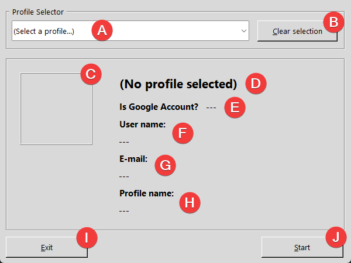

# Chrome Profile Chooser
A custom Google Chrome profile chooser, written in Python 3.x + Tkinter, for users with many profiles.

## Motivation
I have a PC with many profiles on Google Chrome, either linked with Google Accounts or entirely local. As my screen is rather small, the default Google Chrome profile selector quickly became cluttered, resulting in a nightmare to start up Chrome with a chosen profile. Thus, I used Python 3.x and Tkinter to build a custom Chrome Profile Selector, which condenses all profiles in a combo box, presenting to the user the currently selected account information: profile picture or avatar, type of account (Google or local), user name, email and profile name. Pressing the `Start` button will launch Chrome with the selected profile, automatically closing the utility to mimic the traditional profile selector bundled with Chrome.

## Requirements
- Python 3.x (the utility was tested with Python 3.14.5).
- `tkinter` library, for GUI composition.
- `requests` library, for Google Account image download.
- `pydantic` library, for serialization of profile objects.
- `Pillow` library, for profile image manupulation and presentation.
- `pyinstaller`, to create the standalone executable.
- `tzdata` library, as an indirect dependency of `pydantic`.

## How to use
For the time being, this utility works only on Windows (tested in Windows 11). There are plans to make it compatible for Linux systems, as well as create standalone executables, to avoid the commands below.

After downloading the code repository in its own folder, run:
```
> python -m venv env
> .\env\Scripts\activate
(env)> python -m pip cache purge
(env)> python -m pip install --upgrade pip
(env)> python -m pip install -r requirements.txt
(env)> python .\selector.py
```

On some systems, instead of `python` for setting up the environment, one must replace it with `python3`. But after activating it, the other `python` commands remain exactly as shown.

## User interface
The following are the user interface elements of this utility.



<ol type="A">
  <li><b>Profile Selector combo box.</b> The user will select the profile by its display name, i.e. the name the user assigns to the profile, which is at the top of the original Chrome profile selector.</li>
  <li><b>Clear Selection button.</b> Clicking it will clear from the screen the selected profile and all its shown information.</li>
  <li><b>Profile picture.</b> The selected profile avatar or account picture will be shown here.</li>
  <li><b>Profile Display Name.</b> The user-defined profile name for the chosen profile.</li>
  <li><b>Is Google Account?</b> The type of profile: tied to a Google Account (Yes) or local profile with no account (No).</li>
  <li><b>User name.</b> The user name of the Google Account tied to the profile, or the display name for local profiles.</li>
  <li><b>Email address.</b> Depending on the profile type, one of the following options will be shown: the Google Account email address, or <tt>N/A</tt> for local profiles.</li>
  <li><b>Profile internal name.</b> The name Google Chrome uses to identify profiles internally, as well as running them with the <tt>--profile-directory</tt> command line option.</li>
  <li><b>Exit button.</b> When clicked, the program closes.</li>
  <li><b>Start button.</b> Only enabled when a profile is selected. When clicked, the utility opens Google Chrome with the currently selected profile, and then it closes, to mimic the original profile selector behavior.</li>
</ol>
